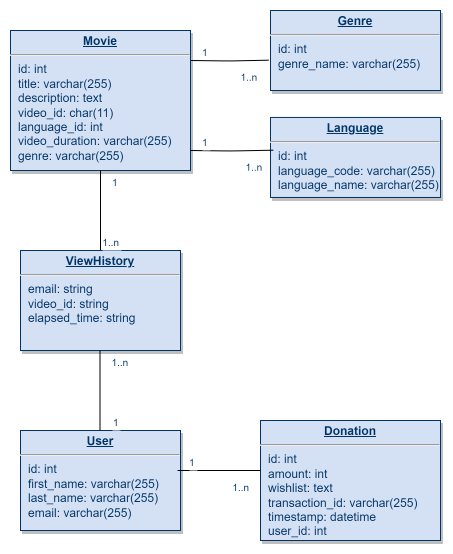

## About

Especially with greasy food, watching shows on a computer while eating can sometimes be inconvenient.

To provide more convenience, this is a movie watching SaaS that can be controlled by hand gestures detected with the help of tensorflow:

- ✊ Pauses a playing movie / Resumes a paused movie
- ☝️ Selects Option 1
- ✌️ Selects Option 2
- 👌 Selects Option 3
- 👍 Proceeds to view movie details / watch movie
- 👈 Back
- 👋 Swipe right to fastforward/scroll forward, left to rewind/scroll backward

## Stack Architecture

## Data Schema

## System requirements

- Node (v20.x)
- Springboot (v3.0.x)
- MySQL (v8.x)

## Environment variables

- SPRING_DATASOURCE_URL
- SPRING_DATASOURCE_USERNAME
- SPRING_DATASOURCE_PASSWORD
- SPRING_DATA_REDIS_HOST
- SPRING_DATA_REDIS_PORT
- SPRING_DATA_REDIS_USERNAME
- SPRING_DATA_REDIS_PASSWORD
- SPRING_MAIL_USERNAME
- SPRING_MAIL_PASSWORD
- STRIPE_SECRET_KEY
- OKTA_OAUTH2_CLIENT_ID
- OKTA_OAUTH2_ISSUER
